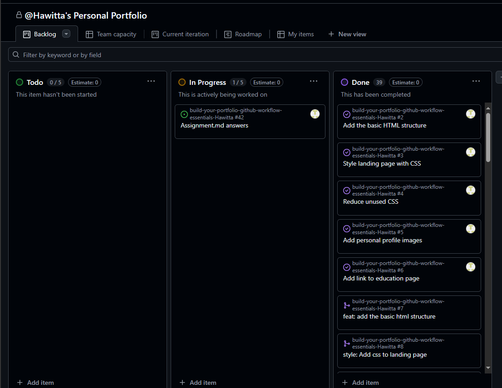

# Personal Portfolio Documentation

## 1. Student Details

- **Full Name**: Hawiana Abebe Bedada
- **GitHub Username**: Hawitta
- **Email**: iamhawiana@gmail.com / hawiana.bedada@strathmore.edu

## 2. Deployed Portfolio Link

- **GitHub Pages URL**:  
  https://is-project-4th-year.github.io/build-your-portfolio-github-workflow-essentials-Hawitta/

## 3. Learnings from the Git Crash Program

Write about **4 things** you expected to learn during the Git crash course (yes, we all came in with some big hopes 😅).
For each one, mention:

What you thought it would be like **(Expectation 👀)**

I came in thinking expecting to learn basics on Github (things I already knew), like commiting and merging conflicts. I thought I would just relearn what I do with all my other repositories

What I actually learned **(Reality 😅)**

I learned much more than I expected. I understood how to properly add commit messages, how to use milestones and labels to categorize tasks that needed to be done. I am geniunely more confident now in using Github without the fear of merge conflicts or overwriting a collegue's work. 

And how it helped with your personal portfolio project 💻

I have gone from following the steps on a paper, to actually performing the tasks smoothly without causing conflict or confusion on my commits. I have been able to make branches for separate tasks and attach them to issues and milestones quite easily now.

## 4. Screenshots of Key GitHub Features

Include screenshots that demonstrate how you used GitHub to manage your project. 
### A. Milestones and Issues

- A list of all the issues under Work Experience Milestone and Projects Milestone

### B. Project Board

- My project board showing the current progress of the tasks

### C. Branching

- Some of the branches created for this project:

### D. Pull Requests

- A closed merge pull request made during development

### E. Merge Conflict Resolution

- Screenshot of a resolved merge conflict (in a pull request, commit history, or your local terminal/GitHub Desktop).
